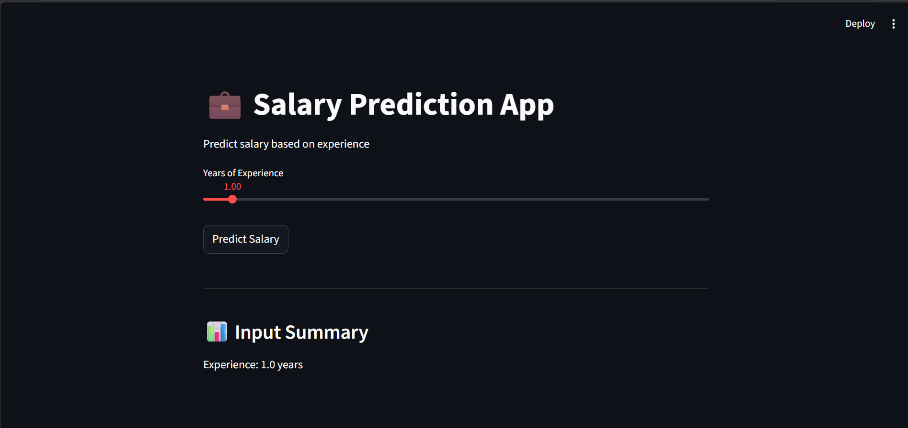

# 💼 Salary Prediction App

## Description

This is a Machine Learning web application built using Streamlit.

The app predicts salary based on years of experience.

---
## Technologies Used
- Python
- Streamlit
- Scikit-learn
- NumPy
- Joblib
---
## Files
- app.py
- salary_model.pkl
- requirements.txt
---
## Installation
```bash
pip install -r requirements.txt
```
---
## Run
```bash
streamlit run app.py
```
---
## Screenshot

---
## Author
**Dheeraj**